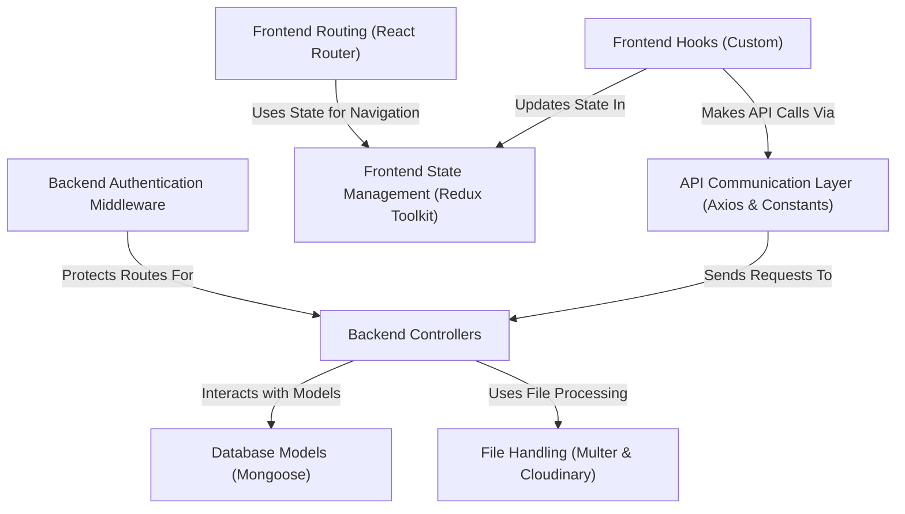

# Tutorial: jobportal

This project is a **job portal** platform. It allows users to *register* and *log in*, acting as either a *job seeker* or a *recruiter*.
Job seekers can *browse* and *apply* for jobs, while recruiters can *post job listings*, *manage companies*, and *view applicants*.
The application uses a database to store all the information about users, jobs, applications, and companies.

## Visual Overview

## Chapters

1. [Backend Authentication Middleware
](01_backend_authentication_middleware_.md)
2. [Database Models (Mongoose)
](02_database_models__mongoose__.md)
3. [Backend Controllers
](03_backend_controllers_.md)
4. [API Communication Layer (Axios & Constants)
](04_api_communication_layer__axios___constants__.md)
5. [Frontend Routing (React Router)
](05_frontend_routing__react_router__.md)
6. [Frontend State Management (Redux Toolkit)
](06_frontend_state_management__redux_toolkit__.md)
7. [Frontend Hooks (Custom)
](07_frontend_hooks__custom__.md)
8. [File Handling (Multer & Cloudinary)
](08_file_handling__multer___cloudinary__.md)
